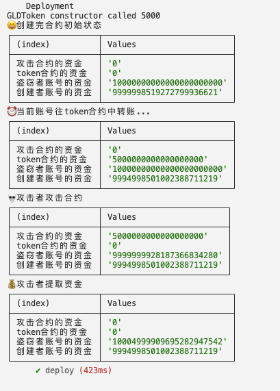

# 重入攻击示例(reentry attack demo)

## 角色(character)
* 盗窃者账号(attacker account)
0x70997970C51812dc3A010C7d01b50e0d17dc79C8
* 当前账号(creator account)
0xf39Fd6e51aad88F6F4ce6aB8827279cffFb92266
* 合约地址(token contract address)
0x5FbDB2315678afecb367f032d93F642f64180aa3
* 攻击合约地址(attack contract address)
0x9fe46736679d2d9a65f0992f2272de9f3c7fa6e0

## 流程(process)
* 1.当前账号创建ERC20合约(create ERC20 contract using current account)
* 2.当前账号创建攻击合约(create Attack contract using current account)
* 3.当前账号给ERC20合约转账(transfer ether to ERC20 contract, making it has some fund)
* 4.攻击合约调用ERC20合约提取资金（调用一次提走合约中所有的钱）(Attack contract call `requestTokens` to withdraw ethers, you will find i called once but withdraw all the ethers in ERC20 contract)

## 执行(run)
`npm install`安装依赖(install dependencies)

`npx hardhat test`查看执行流程(see the process)

## 结果(result)
The status of each step can be viewed through the console, and eventually the thief can be seen to withdraw all the funds after calling the contract method once

可以通过控制台查看每一步的状态，最终可以看到盗窃者调用一次合约方法后，提走了所有资金

## 解决方案（solution）
1. 使用transfer，（限制了转账的gas，避免重入攻击）use `transfer` function to transfer ether.
2. 使用oppenzeppelin的ReentryGuard（写在代码里了）use openzeppelin's standard `ReentrancyGuard` contract